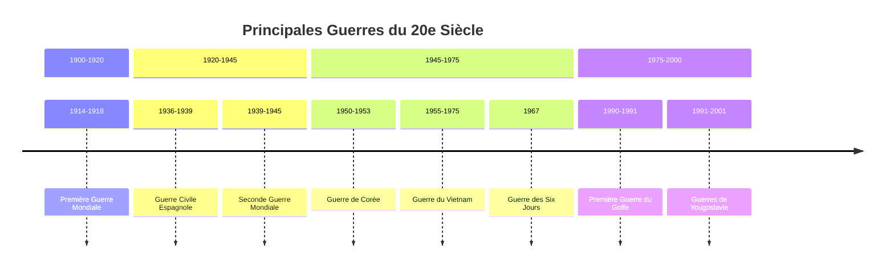

# Époques & Théâtres d’Opérations

```mermaid
timeline
    title Principales Guerres du 20e Siècle
    section 1900-1920
        1914-1918: Première Guerre Mondiale
    section 1920-1945
        1936-1939: Guerre Civile Espagnole
        1939-1945: Seconde Guerre Mondiale
    section 1945-1975
        1950-1953: Guerre de Corée
        1955-1975: Guerre du Vietnam
        1967: Guerre des Six Jours
    section 1975-2000
        1990-1991: Première Guerre du Golfe
        1991-2001: Guerres de Yougoslavie
```